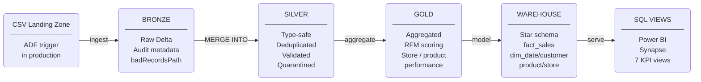
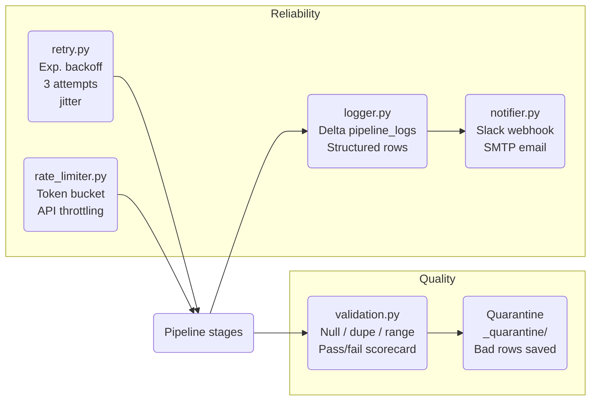
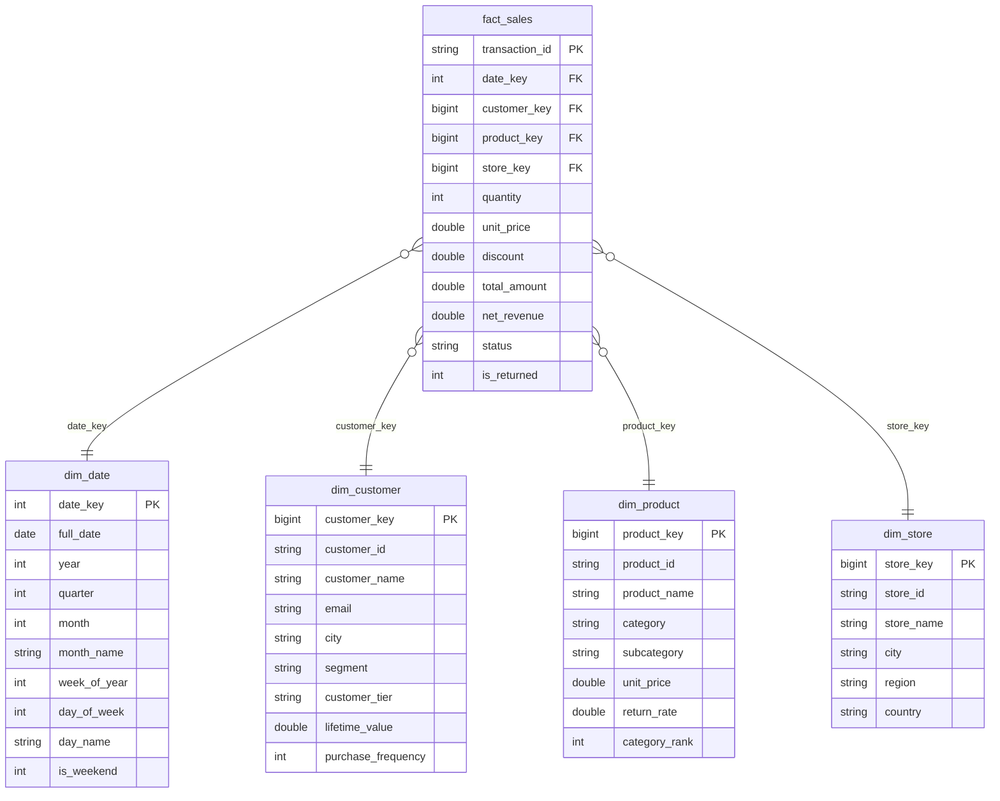

# Retail Sales Analytics Platform

A production-grade data engineering platform demonstrating end-to-end Medallion
Architecture on Databricks with a full Azure stack mapping.

**Business case:** A retail company needs a scalable analytics platform to track
sales performance, customer segments, and product mix across 20 stores, 5,000
customers, and 50,000 transactions over two years.

---

## Architecture





See [`architecture/architecture.md`](architecture/architecture.md) for the full
component diagram, Azure mapping, and optimization notes.

---

## Tech Stack

| Component           | This project                  | Azure Production        |
|---------------------|-------------------------------|-------------------------|
| Storage             | DBFS                          | Azure Data Lake Gen2    |
| Orchestration       | Databricks Jobs               | Azure Data Factory      |
| Processing          | PySpark / Databricks          | Databricks on Azure     |
| Table format        | Delta Lake                    | Delta Lake on ADLS      |
| Warehouse           | Delta + SQL views             | Azure Synapse Analytics |
| BI layer            | Databricks SQL                | Power BI                |
| Monitoring          | Delta `pipeline_logs` table   | Azure Monitor           |
| Notifications       | Slack webhook + SMTP email    | Azure Logic Apps        |
| Version control     | Git                           | Azure DevOps            |

---

## Quick Start

### Prerequisites
- Databricks Community Edition account
- Databricks Runtime 13.3 LTS or higher

### Notification setup (optional)

Alerts are sent via Slack and/or email. Add credentials to a Databricks Secret Scope:

```bash
databricks secrets create-scope retail_platform
databricks secrets put --scope retail_platform --key slack_webhook_url
databricks secrets put --scope retail_platform --key smtp_host
databricks secrets put --scope retail_platform --key smtp_user
databricks secrets put --scope retail_platform --key smtp_password
databricks secrets put --scope retail_platform --key email_from
```

If no secrets are configured, the pipeline runs normally — notifications are skipped with a warning.

### Run order

1. Import all notebooks into your Databricks workspace  
   (File → Import → select `.py` files)

2. Run in order:

   ```
   utils/data_generator        # generates 50k synthetic transactions
   notebooks/00_setup          # creates database + DBFS paths
   notebooks/01_bronze_ingestion
   notebooks/02_silver_transformation
   notebooks/03_gold_aggregation
   notebooks/04_warehouse_star_schema
   notebooks/05_analytics_queries
   notebooks/06_monitoring
   ```

3. Run tests:
   ```
   tests/test_transformations  # 10 unit tests, all should pass
   ```

---

## Key Features

### Medallion Architecture
- **Bronze**: Raw ingestion with explicit schemas, `badRecordsPath`, audit metadata
- **Silver**: Type-safe, deduplicated, validated with quarantine for bad rows
- **Gold**: Pre-aggregated business tables (daily sales, RFM, product performance)

### Delta Lake Optimizations
- `OPTIMIZE + ZORDER BY` on all large tables (customer_id, product_id, date)
- Partition pruning by year/month on fact and transaction tables
- `MERGE INTO` for idempotent incremental loads — safe to re-run
- Change Data Feed enabled for incremental consumption

### Reliability
- **Retry with exponential backoff** (`utils/retry.py`): Delta writes retry up to 3 times with jitter to avoid thundering-herd on busy clusters; wired into Bronze ingestion
- **Rate limiting** (`utils/rate_limiter.py`): Token-bucket `RateLimiter` for external API calls during ingestion; `paginated_api_fetch()` helper wraps any paginated REST API
- Both utilities are independently tested and can be applied to any pipeline stage

### Notifications
- **Slack** (`utils/notifier.py`): Color-coded webhook messages with stage, run ID, row counts, and duration
- **Email**: HTML-formatted SMTP alerts (works with Gmail, SendGrid, Office 365)
- Credentials loaded from Databricks Secret Scope — nothing hardcoded
- Delivery failures are caught and logged; they never crash the pipeline
- Monitoring notebook dispatches ERROR alerts on pipeline failures, WARN alerts on high rejection rate or stale data, INFO on clean runs

### Data Quality
- Schema enforcement at Bronze (explicit StructType, no inference)
- Quarantine pattern at Silver (bad rows saved to `_quarantine/`, pipeline continues)
- `DataValidator` utility produces pass/fail scorecards with configurable thresholds
- 10 unit tests covering: deduplication, quarantine logic, RFM scoring, retry behaviour, rate limiter throttling

### Monitoring
- Every pipeline stage writes structured rows to `pipeline_logs` (Delta)
- `06_monitoring` queries: latest run status, error history, throughput trend, data freshness, Delta file health
- Three alert levels: ERROR (pipeline failure), WARN (data quality / staleness), INFO (healthy run)

### Analytics Layer
- 7 SQL views ready for Power BI connection
- KPIs: executive summary, MoM growth, customer tiers, product rankings, regional store performance, new vs. returning customers
- Star schema: `fact_sales` + `dim_date`, `dim_customer`, `dim_product`, `dim_store`

---

## Data Model

**Fact table:** `fact_sales` — 50,000 rows, grain: one transaction  
**Dimension tables:** `dim_date`, `dim_customer` (5,000), `dim_product` (25), `dim_store` (20)



**Source tables (synthetic):**
- `sales_transactions.csv` — 50,000 rows, 2023–2024
- `customers.csv` — 5,000 rows
- `products.csv` — 25 products across 5 categories
- `stores.csv` — 20 stores across 4 regions

---

## Optimization Results

| Table                  | Optimization Applied                      | Impact                           |
|------------------------|-------------------------------------------|----------------------------------|
| `silver_transactions`  | ZORDER BY (customer_id, product_id, date) | ~40% faster filtered reads       |
| `gold_sales_daily`     | ZORDER BY (store_id, category, date)      | Partition skipping on BI queries |
| `fact_sales`           | Partition by year/month + ZORDER          | Date-range queries skip partitions |
| All Silver/Gold tables | Auto-optimize + auto-compact              | Small file problem prevented     |
| Spark config           | AQE enabled, shuffle.partitions=8         | No empty shuffle files           |

---

## File Structure

```
retail-sales-platform/
├── README.md
├── architecture/
│   └── architecture.md
├── notebooks/
│   ├── 00_setup.py
│   ├── 01_bronze_ingestion.py        # retries on Delta write, success/failure notification
│   ├── 02_silver_transformation.py   # MERGE INTO, quarantine, validation scorecard
│   ├── 03_gold_aggregation.py        # RFM scoring, daily/monthly/store/product aggregates
│   ├── 04_warehouse_star_schema.py   # star schema, FK integrity check
│   ├── 05_analytics_queries.py       # 7 SQL views for Power BI
│   └── 06_monitoring.py              # health checks, real Slack/email alerts
├── utils/
│   ├── data_generator.py             # 50k synthetic transactions
│   ├── logger.py                     # Delta-backed structured logger
│   ├── notifier.py                   # Slack webhook + SMTP email
│   ├── rate_limiter.py               # token-bucket rate limiter for API ingestion
│   ├── retry.py                      # exponential backoff decorator
│   └── validation.py                 # reusable data quality checks
├── sql/
│   └── create_views.sql              # Synapse-compatible SQL views
└── tests/
    └── test_transformations.py       # 10 unit tests (transforms + retry + rate limiter)
```
